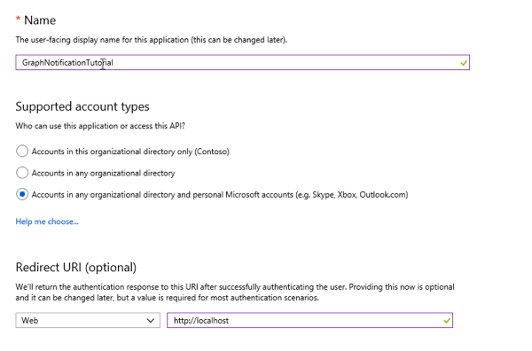
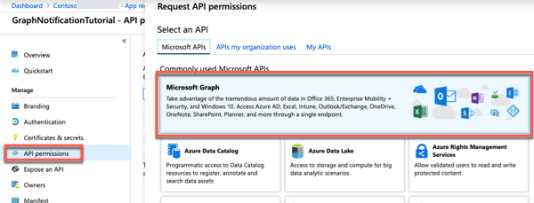

<!-- markdownlint-disable MD002 MD041 -->

在本练习中, 你将使用 Azure Active Directory 管理中心创建新的 Azure AD web 应用程序注册, 并向管理员授予所需权限范围的许可。

1. 打开浏览器并导航到[Azure Active Directory 管理中心 (https://aad.portal.azure.com)](https://aad.portal.azure.com)。 使用**工作或学校帐户**登录。

1. 在左侧导航栏中选择 " **Azure Active Directory** ", 然后选择 "**管理**" 下的 "**应用程序注册**"。

    

1. 选择“新注册”****。 在 "**注册应用程序**" 页上

    

    设置值, 如下所示:

    - **名称**: GraphNotificationTutorial
    - **受支持的帐户类型**: 任何组织目录和个人 Microsoft 帐户中的帐户
    - **重定向 URI**: Web >http://localhost

    

    选择 "**注册**"。

1. 在 " **GraphNotificationTutorial** " 页上, 复制**应用程序 (客户端) id**和**目录 (租户) id**的值保存它, 在下一步中将需要它们。

    

1. 选择 "**管理 > 证书 & 密码**"。 

    选择 "**新建客户端密码**"。

    在 "**说明**" 中输入一个值, 然后选择 "**过期**" 选项之一, 然后选择 "**添加**"。

    

    

1. 离开此页前，先复制客户端密码值。 将在下一步中用到它。

    > [!IMPORTANT]
    > 此客户端密码不会再次显示，所以请务必现在就复制它。

    

1. 选择 "**管理 > API 权限**"。

    选择 "**添加权限**", 然后选择 " **Microsoft Graph**"。

    

    选择 "**应用程序权限**", 展开**用户**组, 然后选择 "**用户" 所有**作用域。

    选择 "**添加权限**" 以保存所做的更改。

    

    

应用程序请求用户的应用程序权限。 **ReadWrite。所有**作用域。 此权限要求具有管理许可。

选择 "**授予对 Contoso 的管理员同意**", 然后选择 **"是"** 以同意此应用程序, 并使用指定的范围授予应用程序对租户的访问权限。

