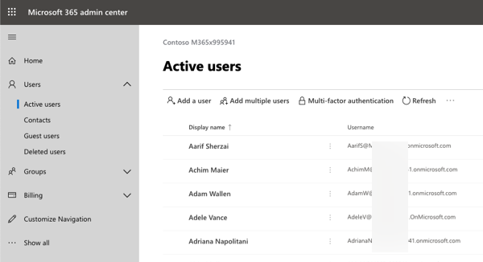

<!-- markdownlint-disable MD002 MD041 -->

<span data-ttu-id="a2007-101">创建用于在 Visual Studio Code 中调试应用程序的启动配置。</span><span class="sxs-lookup"><span data-stu-id="a2007-101">Create a launch configuration to debug the application in Visual Studio Code.</span></span>

<span data-ttu-id="a2007-102">在 Visual Studio Code 中, 选择 "**调试" > "打开配置**"。</span><span class="sxs-lookup"><span data-stu-id="a2007-102">Within Visual Studio Code, select **Debug > Open Configurations**.</span></span>

  

<span data-ttu-id="a2007-104">当系统提示选择环境时, 选择 " **.Net Core**"。</span><span class="sxs-lookup"><span data-stu-id="a2007-104">When prompted to select an environment, select **.NET Core**.</span></span>

  

> [!NOTE]
> <span data-ttu-id="a2007-106">默认情况下, .NET Core 启动配置将在启动调试器时打开浏览器并导航到应用程序的默认 URL。</span><span class="sxs-lookup"><span data-stu-id="a2007-106">By default, the .NET Core launch configuration will open a browser and navigate to the default URL for the application when launching the debugger.</span></span> <span data-ttu-id="a2007-107">对于此应用程序, 我们要转到 NGrok URL。</span><span class="sxs-lookup"><span data-stu-id="a2007-107">For this application, we instead want to navigate to the NGrok URL.</span></span> <span data-ttu-id="a2007-108">如果将启动配置保留为原样, 则每次调试应用程序时, 它将显示一个已损坏的页面。</span><span class="sxs-lookup"><span data-stu-id="a2007-108">If you leave the launch configuration as is, each time you debug the application it will display a broken page.</span></span> <span data-ttu-id="a2007-109">您只需更改 URL, 或将启动配置更改为不启动浏览器:</span><span class="sxs-lookup"><span data-stu-id="a2007-109">You can just change the URL, or change the launch configuration to not launch the browser:</span></span>

<span data-ttu-id="a2007-110">更新 Visual Studio 调试器启动配置:</span><span class="sxs-lookup"><span data-stu-id="a2007-110">Update the Visual Studio debugger launch configuration:</span></span>

  1. <span data-ttu-id="a2007-111">在 Visual Studio Code 中, 打开**vscode/启动**文件。</span><span class="sxs-lookup"><span data-stu-id="a2007-111">In Visual Studio Code, open the file **.vscode/launch.json**.</span></span>
  1. <span data-ttu-id="a2007-112">在默认配置中找到以下部分:</span><span class="sxs-lookup"><span data-stu-id="a2007-112">Locate the following section in the default configuration:</span></span>

      ```json
      "launchBrowser": {
        "enabled": true
      },
      ```

  1. <span data-ttu-id="a2007-113">将`enabled`属性设置为`false`。</span><span class="sxs-lookup"><span data-stu-id="a2007-113">Set the `enabled` property to `false`.</span></span>
  1. <span data-ttu-id="a2007-114">保存所做的更改。</span><span class="sxs-lookup"><span data-stu-id="a2007-114">Save your changes.</span></span>

### <a name="test-the-application"></a><span data-ttu-id="a2007-115">测试应用程序:</span><span class="sxs-lookup"><span data-stu-id="a2007-115">Test the application:</span></span>

<span data-ttu-id="a2007-116">在 Visual Studio Code 中, 选择 "**调试" > 启动调试**以运行应用程序。</span><span class="sxs-lookup"><span data-stu-id="a2007-116">In Visual Studio Code, select **Debug > Start debugging** to run the application.</span></span> <span data-ttu-id="a2007-117">VS 代码将生成和星型应用程序。</span><span class="sxs-lookup"><span data-stu-id="a2007-117">VS Code will build and star the application.</span></span>

<span data-ttu-id="a2007-118">在**调试控制台**窗口中看到以下各项后 .。。</span><span class="sxs-lookup"><span data-stu-id="a2007-118">Once you see the following in the **Debug Console** window...</span></span>


<span data-ttu-id="a2007-120">...打开浏览器并导航到**http://localhost:5000/api/notifications**以订阅更改通知。</span><span class="sxs-lookup"><span data-stu-id="a2007-120">... open a browser and navigate to **http://localhost:5000/api/notifications** to subscribe to change notifications.</span></span> <span data-ttu-id="a2007-121">如果成功, 你将看到包含如下所示的订阅 id 的输出:</span><span class="sxs-lookup"><span data-stu-id="a2007-121">If successful you will see output that includes a subscription id like the one below:</span></span>


<span data-ttu-id="a2007-123">现在, 在 Office 365 租户中的任何用户进行更新时, 您的应用程序将订阅从 Microsoft Graph 接收通知。</span><span class="sxs-lookup"><span data-stu-id="a2007-123">Your application is now subscribed to receive notifications from the Microsoft Graph when an update is made on any users in the Office 365 tenant.</span></span>

<span data-ttu-id="a2007-124">触发通知:</span><span class="sxs-lookup"><span data-stu-id="a2007-124">Trigger a notification:</span></span>

1. <span data-ttu-id="a2007-125">打开浏览器并导航到[Microsoft 365 管理中心 (https://admin.microsoft.com/AdminPortal)](https://admin.microsoft.com/AdminPortal)。</span><span class="sxs-lookup"><span data-stu-id="a2007-125">Open a browser and navigate to the [Microsoft 365 admin center (https://admin.microsoft.com/AdminPortal)](https://admin.microsoft.com/AdminPortal).</span></span>
1. <span data-ttu-id="a2007-126">如果系统提示您登录, 请使用管理员帐户登录。</span><span class="sxs-lookup"><span data-stu-id="a2007-126">If prompted to login, sign-in using an admin account.</span></span>
1. <span data-ttu-id="a2007-127">选择 "**用户 > 活动用户**"。</span><span class="sxs-lookup"><span data-stu-id="a2007-127">Select **Users > Active users**.</span></span>

    

1. <span data-ttu-id="a2007-129">选择一个活动用户并为其**联系人信息**选择 "**编辑**"。</span><span class="sxs-lookup"><span data-stu-id="a2007-129">Select an active user and select **Edit** for their **Contact information**.</span></span>

    

1. <span data-ttu-id="a2007-131">使用新号码更新**电话号码**值, 然后选择 "**保存**"。</span><span class="sxs-lookup"><span data-stu-id="a2007-131">Update the **Phone number** value with a new number and Select **Save**.</span></span>

    <span data-ttu-id="a2007-132">在 Visual Studio Code**调试控制台**中, 您将看到已收到通知。</span><span class="sxs-lookup"><span data-stu-id="a2007-132">In the Visual Studio Code **Debug Console**, you will see a notification has been received.</span></span> <span data-ttu-id="a2007-133">有时, 这可能需要几分钟的时间才能到达。</span><span class="sxs-lookup"><span data-stu-id="a2007-133">Sometimes this may take a few minutes to arrive.</span></span> <span data-ttu-id="a2007-134">输出的示例如下:</span><span class="sxs-lookup"><span data-stu-id="a2007-134">An example of the output is below:</span></span>

    ```shell
    Received notification: 'Users/7a7fded6-0269-42c2-a0be-512d58da4463', 7a7fded6-0269-42c2-a0be-512d58da4463
    ```

<span data-ttu-id="a2007-135">这表示应用程序成功接收到在输出中指定的用户的来自 Microsoft Graph 的通知。</span><span class="sxs-lookup"><span data-stu-id="a2007-135">This indicates the application successfully received the notification from the Microsoft Graph for the user specified in the output.</span></span> <span data-ttu-id="a2007-136">如果要将用户的详细信息同步到您的应用程序中, 则可以使用此信息查询 Microsoft Graph 以了解用户的详细信息。</span><span class="sxs-lookup"><span data-stu-id="a2007-136">You can then use this information to query the Microsoft Graph for the users full details if you want to synchronize their details into your application.</span></span>